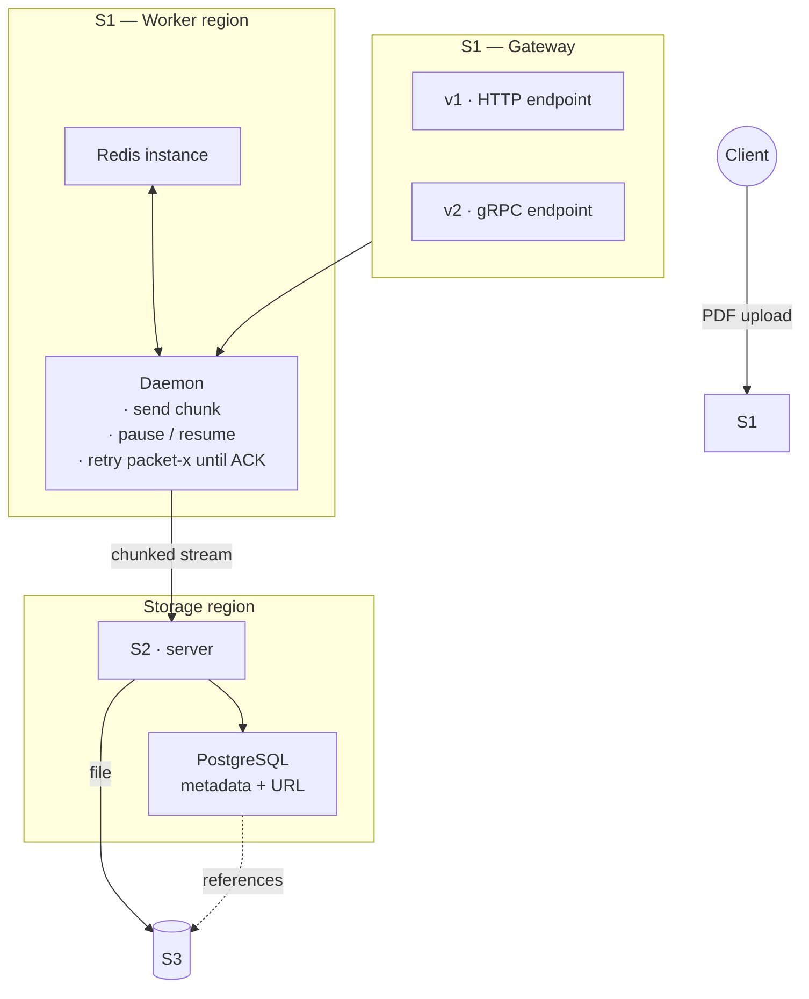

# PDF Upload Service Architecture

Below is the high-level architecture diagram for the PDF upload flow:

```mermaid
flowchart TD
    Client((Client)) -->|PDF upload| S1

    subgraph S1_gateway["S1 — Gateway"]
        v1["v1 · HTTP endpoint"]
        v2["v2 · gRPC endpoint"]
    end

    S1_gateway --> Daemon

    subgraph S1_worker["S1 — Worker region"]
        direction TB
        Redis["Redis instance"]
        Daemon["Daemon\n· send chunk\n· pause / resume\n· retry packet-x until ACK"]
        Redis <--> Daemon
    end

    Daemon -->|chunked stream| S2

    subgraph Storage["Storage region"]
        direction TB
        S2["S2 · server"]
        PG["PostgreSQL\nmetadata + URL"]
        S2 --> PG
    end

    S2 -->|file| S3[("S3")]
    PG -.->|references| S3
```
